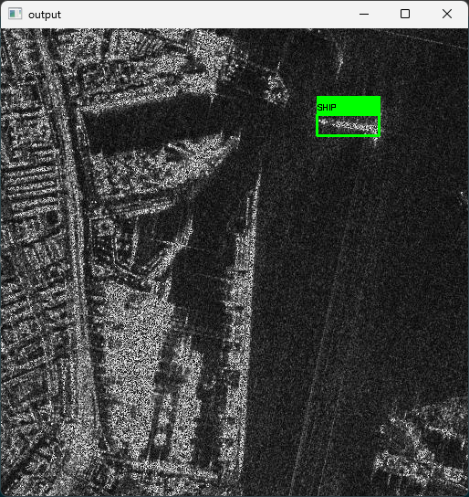

### SAR (Synthetic Aperture Radar) Satellite Ship Detection
git clone the YOLOv5 github into directory and setup

Dataset cleaning
- Using the SAR dataset at https://github.com/zcablii/SARDet_100K?tab=readme-ov-file
- `python test_train_split.py`

Training
- `python yolov5/train.py --img 640 --batch 16 --epochs 5 --data dataset.yaml --weights yolov5s.pt --device=0`
- Set device to CUDA GPU if available

Testing
- `python yolov5/detect.py --weights yolov5/runs/train/exp/weights/best.pt --img 640 --conf 0.4 --source yolov5_test/<image name>.jpg`

