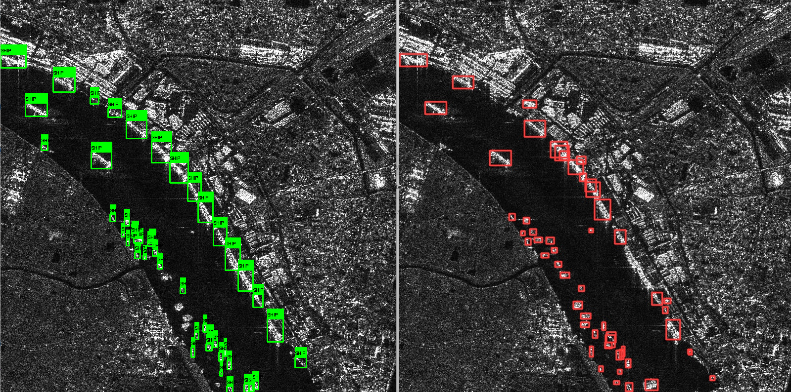

### SAR (Synthetic Aperture Radar) Satellite Ship Detection
Synthetic Aperture Radar is an imaging technique used to produce high-res images of landscapes and objects, allowing for imaging through clouds or darkness. SAR achieves high spatial resolution by simulating a large antenna aperture through the movement of the radar platform and control of polarization.

This project trains the YOLOv5 model on the HRSID dataset to automate ship detection, involving data preprocessing, feature extraction, model training, and inference to monitor ship movements.

This uses the HRSID dataset, with images from the TerraSAR-X, TanDEM-X and Sentinel-1B satellites.
https://ieeexplore.ieee.org/stamp/stamp.jsp?tp=&arnumber=9127939

YOLOv5
- `git clone https://github.com/ultralytics/yolov5 `
- install requirements, setup torchvision and pytorch

Dataset pre-processing
- Download the dataset (https://github.com/chaozhong2010/HRSID)
- Convert to YOLO format:
- `python test_train_split.py train`
- `python test_train_split.py test`

View SAR image with annotated ships
- `python describe_image.py train/<image name>`

Training
- `python yolov5/train.py --img 640 --batch 16 --epochs 5 --data dataset.yaml --weights yolov5s.pt --device=0`
- Set device to CUDA-compatible GPU if available, otherwise it will be very slow
- Lower batch size to 8 if OOM, or use half precision `--half`

Testing
- `python yolov5/detect.py --weights yolov5/runs/train/exp/weights/best.pt --img 640 --conf 0.4 --source yolov5_test/*`

Todo
- Denoising using deep despeckling network approach (https://arxiv.org/pdf/2110.13148)
- Custom optimizations of yolov5
    - Feature extraction CNN (https://www.sciencedirect.com/science/article/pii/S240595952300036X)
    - Attention mechanism (https://www.frontiersin.org/articles/10.3389/fmars.2022.1086140/full)
- Background-only images for validation
- Ship classification (military, civilian cargo, fishing)